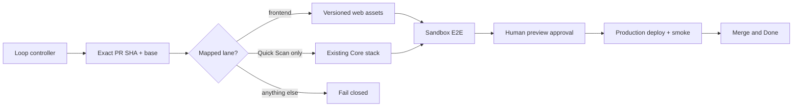

# IVANRY loop adapter

This private repository is the IVANRY-specific boundary around the generic
[`ROSHDEVAU/loop-engineering`](https://github.com/ROSHDEVAU/loop-engineering)
controller. It owns IVANRY's model routing, GitHub Project mapping, validation
commands, the `preview.ivanry.com` sandbox contract, and narrowly scoped
production delivery lanes.

The stock portfolio repository intentionally contains no loop configuration,
dispatcher, preview, production, or release-plan scripts. A local registry
links that repository identity to this checked-in configuration:

```sh
cd /path/to/stock-portfolio-mgmt
loopctl project link /path/to/ivanry-loop-adapter/loop.config.json
loopctl doctor
```

`ivanry-loop-adapter` is installed locally with `npm link`. Every command uses
`LOOP_PROJECT_ROOT` supplied by `loopctl`; it never guesses another checkout.

The automatic production lanes accept mapped static frontend changes and one
reviewed Quick Scan outcome: `backend/functions/portfolios/insights/index.ts`.
The latter updates only the existing core application stack and is protected by
the same exact-SHA preview, focused E2E, rollback snapshot, and explicit human
production approval. Every other backend, infrastructure, identity,
access-control, financial-data, billing, migration, and unknown path fails
closed for a separately reviewed lane. No deployment runs during installation
or tests.



Preview delivery is bound to AWS account `109837541383`, profile
`ivanry-sandbox`, `us-east-1`, and the verified `IvanrySandboxCoreStack`
outputs. Frontend preview captures the current versioned S3 object set, builds
the exact loop SHA with public sandbox runtime values, publishes it to the
verified sandbox bucket, and invalidates the verified distribution. The Quick
Scan lane instead deploys only the existing `IvanrySandboxCoreStack`, after
capturing its deployed CloudFormation template. If E2E fails, rollback restores
the captured frontend objects and/or the exact pre-release stack template.

Preview preparation refreshes the one permanent reserved
`loop.preview.e2e@portfolio.invalid` identity and its sandbox-only paid profile,
writes credentials only to an ignored mode-0600 runtime file, allows the build
and invalidation interval for propagation, and deletes that file after E2E.
Playwright never rotates the password immediately before browser sign-in. An existing Cognito identity is accepted only when it is the
exact confirmed reserved address; an existing application record must also be
marked `e2eSynthetic=true`.

Confirmed sandbox AWS IAM/KMS `AccessDenied` blockers may enter the generic
engine's governed platform-repair path. The infrastructure engineer edits only
a separate IaC repair worktree and has no cloud or deployment authority. A
fresh security reviewer must reject wildcards and production changes; only the
lead may run a reviewed, target-verifying sandbox command and resume the parent
feature after the exact denied operation passes. Production permission repair
is never automatic.

The repair lane is intentionally limited to
`infrastructure/lib/stacks/ApiStack.ts`. Its controller validates the exact
child PR, runs the infrastructure build, captures an executable rollback
template, deploys only `IvanrySandboxCoreStack`, and uses IAM policy simulation
for the exact denied action/principal/resource. A failed deploy, verification,
or child-PR merge invokes the captured sandbox rollback and blocks the parent.
The original feature E2E must still pass after the parent loop resumes.
